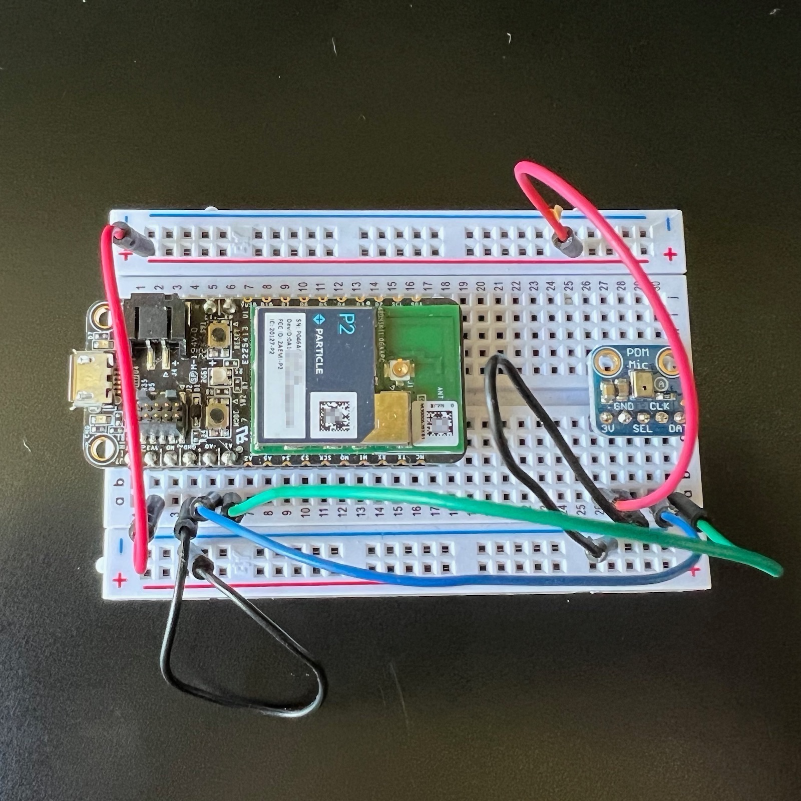

# keyword-spotting blueprint

## To use in Particle Workbench

1. In Workbench, select **Particle: Import Project** and select the `project.properties` file 

1. Use **Particle: Configure Project for Device** and select the platform such as **P2** and the latest 5.x or 6.x release.

1. Compile with  **Particle: Compile application (local)**

1. Flash with **Particle: Flash application (local)**

> At this time you cannot use the **Particle: Cloud Compile** or **Particle: Cloud Flash** options; local compilation is required.

# Keyword spotting

## Overview

The Keyword Spotting tutorial is reference project to identify the keywords "Yes" and "No" in audio data received from a PDM microphone.

This solution is designed for Particle devices like the Photon 2, Boron, and M-SoM.

## Key Features

- **Edge Impulse Integration**: Uses Edge Impulse's machine learning capabilities to train a model for your own keywords.
- **Seamless Deployment**: Supports Particle devices such as the Photon 2, Boron, and M-SoM, enabling efficient edge processing.
- **Versatile Applications**: Suitable for applications such as smart home systems.

## Prerequisites

To complete this project, you will need:

1. **Particle Device**: Photon 2, Boron, or M-SoM.
   - [Purchase here](https://store.particle.io/collections/all-products?filter.p.product_type=Development%20Boards)
2. **PDM microphone**
   - [For use in a breadboard](https://www.adafruit.com/product/3492) 
   - [With JST-SH connector](https://www.adafruit.com/product/4346)
3. **Edge Impulse Account**: Sign up at [Edge Impulse](https://www.edgeimpulse.com/) to train the model.

## Table of Contents

- [Overview](#overview)
- [Key Features](#key-features)
- [Prerequisites](#prerequisites)
- [Setup Steps](#setup-steps)
  - [1. Configure the Hardware](#1-configure-the-hardware)
  - [2. Collect Training Data](#2-collect-training-data)
  - [3. Train the Model on Edge Impulse](#3-train-the-model-on-edge-impulse)
  - [4. Deploy the Model to Particle](#4-deploy-the-model-to-particle)
  - [5. Test and Fine-Tune](#5-test-and-fine-tune)
- [Conclusion](#conclusion)

## Setup Steps

### 1. Configure the Hardware

1. Connect a microphone to your Particle device (Photon 2, Boron, or M-SoM).

The pins needed for Adafruit PDM microphones are:

| Breakout Pin | Particle Pin | Description | Color |
| --- | --- | --- | --- |
| 3V | 3V3 | Power 3.3V | Red |
| GND | GND | Ground | Black |
| SEL | | Left/Right Select | No Connection |
| CLK | A0 | PDM Clock | Blue | 
| DAT | A1 | PDM Data | Green | 

- SEL - Left/Right select. If this pin is high, the output is on the falling edge of CLK considered the 'Right' channel. If this pin is low, the output is on the rising edge, a.k.a 'Left' channel. Has a pull-down to default to left so you can leave it unconnected.
- CLK - PDM clock into breakout board, 1 - 3 MHz square wave required.
- DAT - PDM data out of breakout board

On the nRF52 (Boron, etc.) the PDM CLK and DAT lines are configurable to other pins, but on RTL872x, only specific pins can be used:

| Signal | P2/Photon 2 | M-SoM/Muon | nRF52 |
| :--- | :---: | :--: | :---: |
| CLK | A0 | A3 | Any |
| DAT | A1 | A4 | Any |

On both MCUs, the built-in hardware PDM decoder is used, along with DMA to write to the buffer, so the operation is 
very efficient and does not block the execution of your code while sampling audio.

2. Set up your Particle device in the Particle Console to ensure it’s online and ready to transmit data.

## To update this project

### 1. Collect Training Data 

1. **Log into Edge Impulse** and create a new project for keyword detection.
2. Go to the **Data Acquisition** tab and collect sample data for the words you wish to detect. If you are generating your own audio sample data,
you can generate samples using your phone, which is often easier than getting the raw samples off your Particle device.

### 2. Train the Model on Edge Impulse

1. In Edge Impulse, go to **Create Impulse** and select a suitable **Signal Processing Block** (e.g., Spectral Analysis) for audio or vibration data.
2. Add a **Learning Block** for classification.
3. Go to the **Training** tab, configure training parameters, and start training the model.
4. Monitor the training results to ensure high accuracy in distinguishing running water sounds.

### 3. Deploy the Model to Particle

1. Once the model is trained, go to the **Deployment** tab in Edge Impulse.
2. Export the model as a C++ library or a Particle-compatible model file.
3. Upload the model to your Particle device using the Particle CLI or Web IDE.
4. Configure the device firmware to run the model and classify data from the sensor.

### 4. Test and Fine-Tune

1. Deploy the Particle firmware and begin testing the device in real-world conditions.
2. Use the **Edge Impulse Live Classification** feature to validate model accuracy.
3. Fine-tune the model as needed by collecting additional data or adjusting training parameters.
